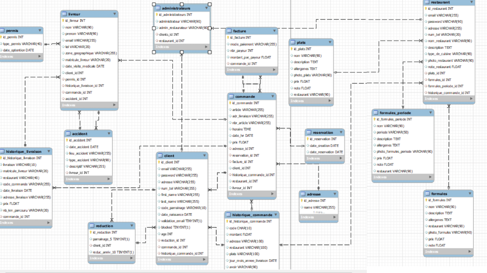
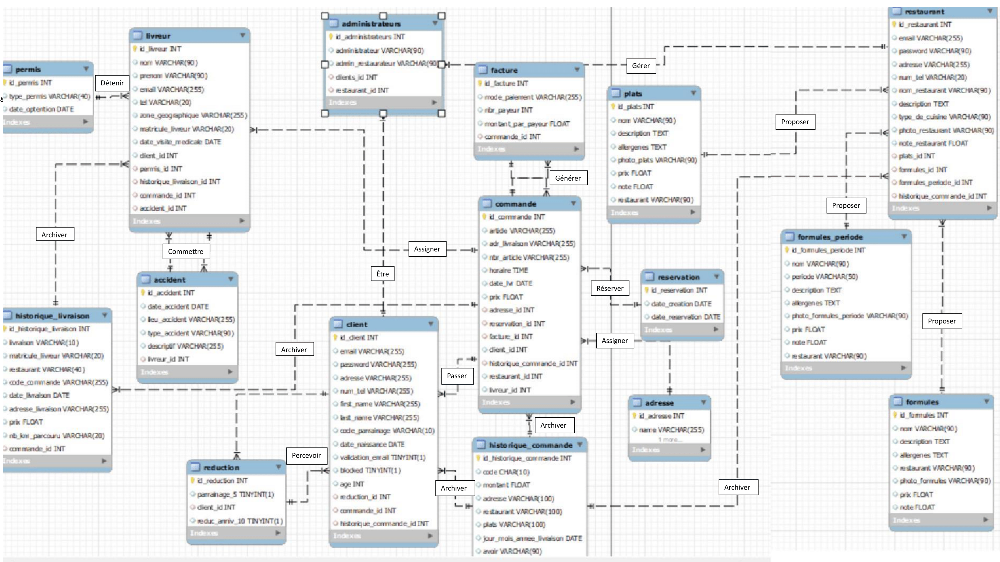

# Projet Base de Données - Système de Gestion de Commande de Nourriture

Ce dépôt GitHub contient les documents et le code source associés au projet de base de données pour un système de gestion de commande de nourriture.

## Initialisation du Projet

Si vous possédez déjà une base de données appelée 'projet_tutkinnon', remplacez les premières lignes du code par :


```sql
CREATE DATABASE projet_nom_1;
USE DATABASE projet_nom_1;
```
# Modèle de Données

Ce projet repose sur un modèle de données qui se divise en deux parties principales : le Modèle Conceptuel de Données (MCD) et le Modèle Logique de Données (MLD).

## Modèle Conceptuel de Données (MCD)



Le MCD représente les entités et leurs relations de manière abstraite, offrant une vue globale de la structure de la base de données.

## Modèle Logique de Données (MLD)



Le MLD traduit le MCD en un schéma relationnel précis, définissant les tables, les clés primaires, les clés étrangères et les contraintes.


# Crédits

Le projet a pu être mené à bien grâce à la participation de :

## Contributeurs

- [Hugo Galley](https://github.com/Hugo-Galley)
- Ioan Domingues
- Justine Guy
- Jéremy Besson

## Remerciements spéciaux

- [Alan Busi](https://github.com/nom-de-la-personne-ou-organisation](https://github.com/AllanBUSI)) - Pour ses conseils et ses ressources.

